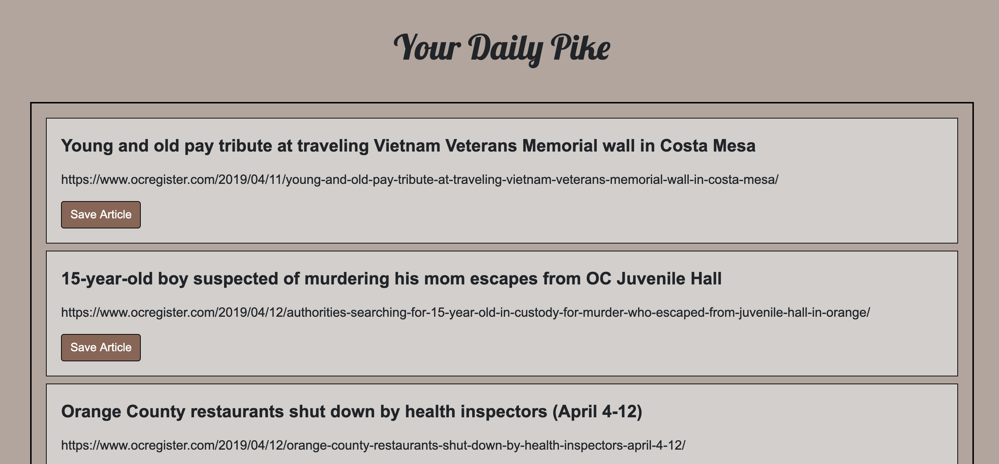
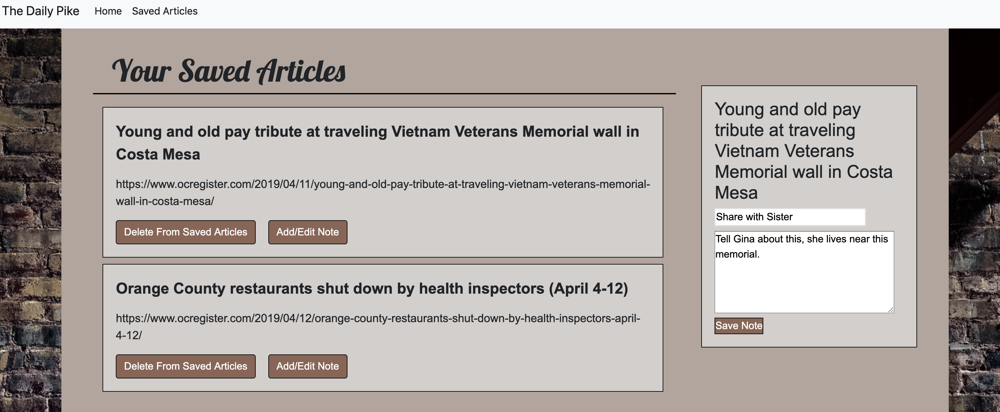

#  The Daily Pike 
 _Full Stack Application_

#### Deployed Link:
* https://scrape-news-notes.herokuapp.com/

### About

Demonstrates scraping method by showing news articles from the Orange County Register. Clicking “Scrape” will refresh your list with an updated list of articles. You can save articles and save notes to each article saved. You may also remove articles you no longer wish to keep on your saved list. 

***

***

***

### Technologies Used

* MongoDB

* Mongoose

* Cheerio

* Ajax

* Node JS

* Express

* Javascript

